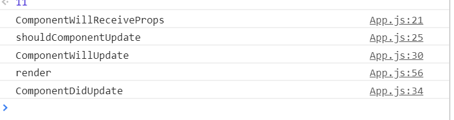

React lifecycle
===============
在react中，触发render的有4条路径。以下假设shouldComponentUpdate都是按照默认返回true的方式(当返回false时不会触发shouldComponentUpdate之后的生命周期)。
！
*首次渲染Initial Render
！	
*调用this.setState（并不是一次setState会触发一次render，React可能会合并操作，再一次性进行render）

*父组件发生更新（一般就是props发生改变，但是就算props没有改变或者父子组件之间没有数据交换也会触发render）

*调用this.forceUpdate

